# 「이미 있어」 주간 운영 브리핑 — 사람이 승인하는 발행 게이트 보고서

「에이전트 팀 꾸리기 (Agt1)」 10단원 「사람이 승인하는 에이전트 만들기」 프로젝트.
저장소는 Main Quest 4 제출본 [already-got-it-agent](https://github.com/hey-byeunya/already-got-it-agent)를 복사해 시작했고,
이번에 더한 것은 **발행 게이트** — 에이전트가 만든 카드뉴스를 슬랙으로 보내기 직전에, 기준에 걸린 브리핑만 사람에게 세우는 단계다.

- 실행 방법: [README.md](./README.md) · 선택과 이유: [DECISIONS.md](./DECISIONS.md) D37~D50
- 화면 캡처: [`evidence/hitl/`](./evidence/hitl/) (13장)
- 모든 숫자는 2026-09-28 로컬 실행 기준이다. 재현: `cd agent && npm run gate-compare -- --set dev|holdout|validation --detail`
- **실제 운영 데이터로 돌린 8편의 원자료(카드 · 도구 기록)는 공개 저장소에 넣지 않았다** — 비공개 앱 저장소의 이슈 · 배포 주소 · 사용자 아이템 ID 가 들어 있다 (D46).
  그래서 저장소만으로 다시 돌리면 합성 픽스처 9편(dev 3 · holdout 4 · validation 2)만 나온다. 아래 표의 dev · validation 숫자는 로컬에서 8편을 포함해 잰 값이다.

### 평가기준과 이 보고서

| 평가기준 | 어디서 확인하나 |
|---|---|
| 바꿀 수 없는 결정(슬랙 발송) 전에 멈추고, 사람의 답을 받아 이어서 실행한다 | 2절 구조도 · 2-3 끊겼을 때 · 4-1 사람이 처리한 8편 · 캡처 [hitl-03](./evidence/hitl/hitl-03-gate-pending.png) [hitl-08](./evidence/hitl/hitl-08-decided-retry.png) [hitl-11](./evidence/hitl/hitl-11-slack-sent-approved.png) |
| 승인이 필요 없는 건은 자동으로 처리하고, 대기 건은 보관한다 | 3-2 자동 예시 · 2-2 `publish.json` · 캡처 [hitl-01](./evidence/hitl/hitl-01-publish-queue.png) [hitl-09](./evidence/hitl/hitl-09-auto-published.png) [hitl-12](./evidence/hitl/hitl-12-slack-sent-auto.png) |
| 승인 기준을 설계하고 이유를 설명한다 (계산 가능한 기준 2개 이상 · 각 위험) | 3절 — 계산 가능한 기준 4개, 각 기준이 막으려는 위험, 버린 기준과 숫자 |
| 승인 과정을 확인할 수 있는 웹 데모 | 5절 · [README.md](./README.md) 「실행」 (모델 없이 승인 화면을 여는 데모 포함) |
| 설계와 결과를 REPORT.md 에 정리한다 | 이 문서 1~6절 |

---

## 1. 주제와 고른 이유

### 어떤 업무를 자동화했나

「이미 있어」를 운영하는 개발자를 위해, 에이전트가 매주 시스템 상태 · 사용자 지표 · 개발 활동 · IT 트렌드를 읽어
**카드뉴스 5~8장**을 만든다. 이번 프로젝트는 그 결과물을 **슬랙 채널 `#ops-brief` 로 발행**하는 단계를 붙이고,
그 앞에 사람의 승인을 둔다. **판단 단위는 브리핑 한 편 = 슬랙 메시지 하나**다.

### 어느 단계에서 결과가 바깥으로 나가나

| 단계 | 결과가 있는 곳 | 바깥? |
|---|---|---|
| 조회 · 카드 작성 (에이전트) | 로컬 `runs/{id}/cards/*.json` — 몇 번이고 고칠 수 있다 | 안 나간다 |
| 발행 게이트 판정 · 사람 대기 | 로컬 `runs/{id}/publish.json` | 안 나간다 |
| **`sendSlack` — 슬랙 웹훅 POST** | 팀 채널 `#ops-brief` | **여기서 나간다. 지울 수 없다** |
| (원래 있던 것) GitHub 이슈 생성 | 저장소 이슈 | 나간다 — 실행 중 도구 승인(D14)이 따로 막는다 |

게이트는 세 번째 줄 바로 앞, 결과가 바깥으로 나가기 직전 한 곳에만 둔다.

### 왜 여기인가

| 이유 | 설명 |
|---|---|
| **되돌릴 수 없다** | 슬랙 Incoming Webhook 으로 보낸 메시지는 지울 수 없다 (D39). 틀린 원인·틀린 숫자가 한 번 나가면 팀이 그대로 읽는다 |
| **읽는 사람이 곧바로 행동한다** | 「지금 손봐야 할 것」 카드는 받는 사람이 바로 고치러 가는 카드다. 틀리면 비용이 행동으로 나간다 |
| **전부 세우면 안 된다** | 매주 모든 브리핑을 확인하게 하면 4강에서 본 대로 「승인 버튼만 누르는」 상태가 된다. 조용한 주는 자동으로 나가야 사람이 멈춘 건을 진지하게 본다 |
| **에이전트 안의 게이트와는 다른 자리다** | 원래 저장소에도 HITL 이 있다 — GitHub 이슈 생성·닫기는 사람이 승인해야 실행된다 (D14). 그건 **실행 중 한 도구 호출**을 막는다. 이번 게이트는 **다 만든 결과물 전체**를 밖으로 내보낼지를 정한다 |

### 왜 구글챗이 아니라 슬랙인가

처음에는 구글챗으로 보내려 했다. 수신 웹훅과 Chat API 모두 Business/Enterprise Google Workspace 계정이 있어야 해서
개인 Gmail 로는 프로그램이 보낼 길이 없었다. 발행은 어댑터 한 곳(`sendSlack`)에 모아 두었다 (D39).

---

## 2. 파이프라인 구조

### 2-1. 노드와 흐름

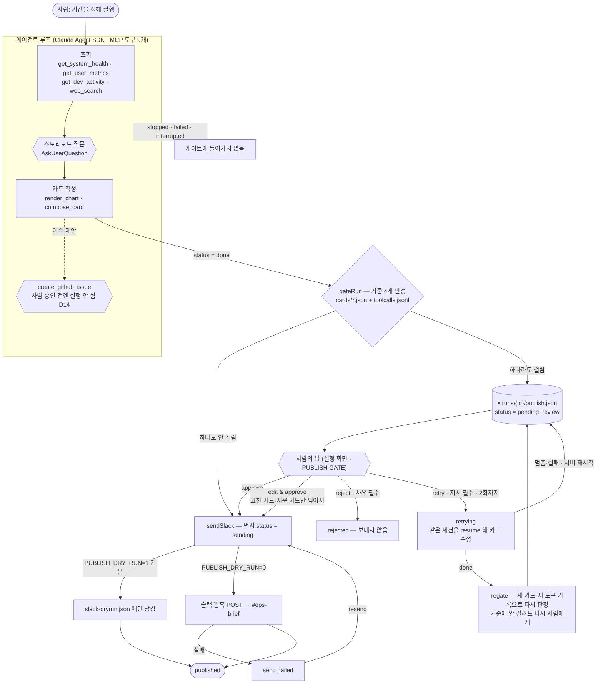

- **멈추는 곳**: `gateRun` 이 기준에 걸린 브리핑을 `pending_review` 로 `publish.json` 에 쓰고 끝난다. 기다리는 콜백은 없다.
- **재개하는 곳**: 사람이 답을 보내면 `POST /api/runs/{id}/publish` 가 `publish.json` 을 읽어 **버전을 확인한 뒤** 다음 상태로 옮긴다.
  서버가 그사이 몇 번 재시작했어도 파일에서 그대로 이어진다.
- **게이트를 에이전트 루프 밖에 둔 이유** (D37): 에이전트 안의 질문·승인 대기는 메모리의 콜백이라 재시작하면 `interrupted` 가 된다.
  발행 대기는 **이미 다 만든 결과물**을 내보낼지의 문제라 콜백이 필요 없다. LangGraph 에서 체크포인터가 하던 일을 파일 하나가 맡는다.

### 2-2. State — `publish.json` 이 들고 다니는 것

| 필드 | 뜻 | LangGraph 에 대면 |
|---|---|---|
| `version` | 답을 받을 때마다 1씩 오른다. 화면이 본 버전과 다르면 `stale_version` 409 | 같은 interrupt 에 두 번 답하지 않게 |
| `status` | 아래 상태 기계의 현재 칸 | 그래프의 현재 노드 |
| `route` | `review`(사람을 거침) · `auto`(기준 통과) | 어느 가지로 갔나 |
| `gate` | `{stop, hits[{rule, detail}], checked_cards}` — 왜 멈췄나 | interrupt 에 실어 보낸 값 |
| `decisions[]` | 사람의 답 기록 (`action` · 사유 · 지시 · 시각) | resume 값의 이력 |
| `edits[]` | 고친 카드 `{card_no, title?, body?, remove?}` — 원본 파일은 그대로 | 사람이 바꾼 state |
| `retries` | 다시 판정 횟수 (최대 2) | |
| `sent` | `{at, dry_run, channel}` — 있으면 다시 보내지 않는다 | |

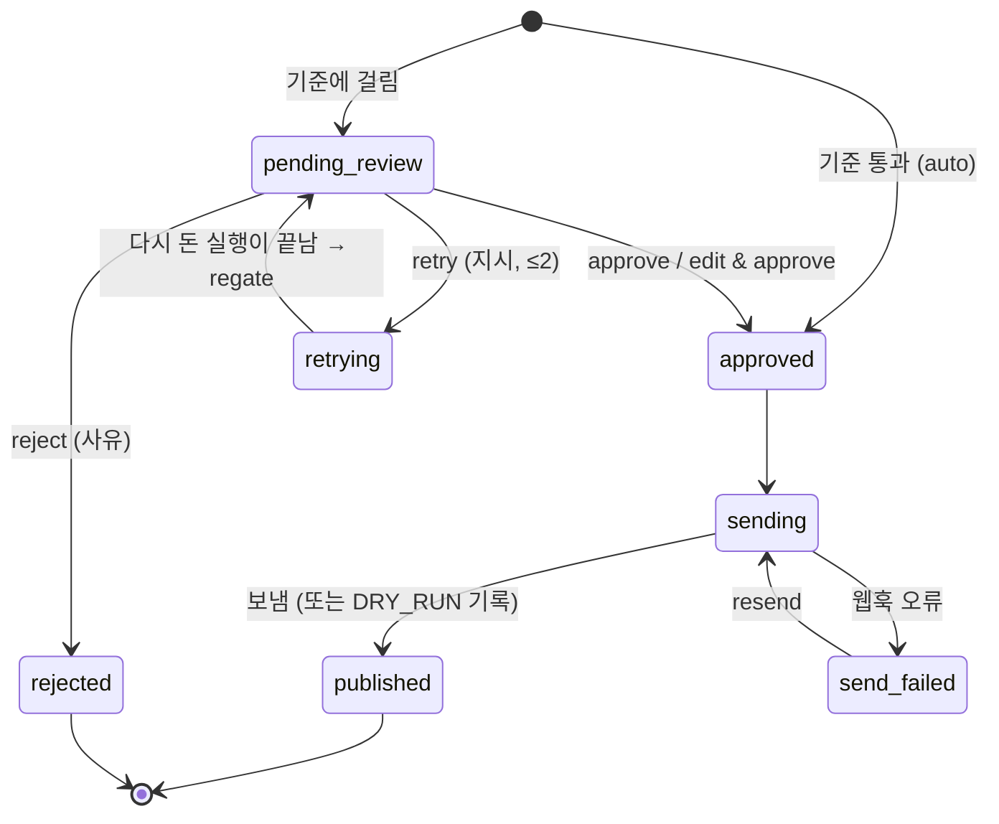

판정(`evaluateGate`)과 전이(`applyDecision` · `beginSend` · `finishSend`)는 **IO 없는 순수 함수**다 (`agent/src/publish.ts`).
파일과 네트워크는 앱(`app/lib/publish.ts`)에만 있다. 그래서 같은 규칙으로 비교표를 돌리고, 테스트가 IO 없이 돈다.

### 2-3. 끊겼을 때

| 상황 | 처리 |
|---|---|
| 대기 중 서버 재시작 | `publish.json` 이 남아 있어 대기 목록·실행 화면에 그대로 뜬다 (D37 검증) |
| 다시 판정 중 서버 재시작 | 실행이 살아 있지 않으면 `settleOrphanRetry` 가 읽는 순간 정리한다 — done 이면 다시 판정, 아니면 이전 판정 그대로 대기로 (D42 개정) |
| 같은 승인을 두 번 누름 | 두 번째는 `stale_version` 409. 보내는 중에 온 요청은 `beginSend` 가 거절 — **두 번 나가지 않는다** (실제 슬랙에서 확인) |
| 슬랙 오류 | `send_failed` + 이유를 남기고 대기 목록의 답할 건에 올린다. `resend` 로 다시 보낸다 |

---

## 3. 승인 기준

### 3-1. 채택한 기준 네 개 — 모두 도구 데이터에서 계산한다

하나라도 걸리면 브리핑 한 편 전체를 사람에게 보낸다 (`GATE_RULES`, `agent/src/publish.ts`).

| 기준 | 계산 | 막으려는 위험 |
|---|---|---|
| `deploy_failed` | `get_system_health · summary.error ≥ 1` | 사용자가 겪었을 수 있는 장애다. 확인 없이 알림 한 줄로 흘려보내면 원인·복구 여부가 틀린 채로 팀에 퍼진다 |
| `errors_up` | `get_user_metrics · totals.errors_total > previous_period_totals.errors_total` (**둘 다 값이 있을 때만**) | 조용히 늘어나는 에러다. 원인을 모른 채 숫자만 퍼지면 엉뚱한 곳을 의심하거나, 반대로 아무도 손대지 않는다 |
| `stale_issue` | `get_dev_activity · summary.oldest_open_issue_days ≥ 7` (브리핑 주기와 같은 7일) | 지난 브리핑 때도 열려 있던 문제다. 매주 같은 알림으로 반복되면 무뎌진다. 누가 맡을지 사람이 정하고 내보낸다 |
| `tool_failed` | 위 세 도구 중 **성공한 호출이 한 번도 없는** 것이 있다 | 그 축의 사고를 볼 수 없었다. 나머지 기준이 조용한 것은 「문제가 없어서」가 아니라 「모르기 때문」일 수 있다 |

사람이 정한 판단 원칙 (라벨을 붙이며 확인): **「우리 앱 안에서 생긴 일(배포 실패·에러 증가·방치된 이슈)이 있으면 봐야 하고,
외부 보안 권고만 있는 조용한 주는 자동으로 보내도 된다.」** 네 기준은 이 문장을 계산할 수 있는 모양으로 옮긴 것이다.

### 3-2. 자동으로 나가는 경우 (예시)

| 브리핑 | 신호 | 왜 사람을 거치지 않아도 되나 |
|---|---|---|
| `live-t2` (실제 데이터, dev · 원자료는 공개 저장소에서 뺐다) | 배포 0 · 이슈 0일 · 세 도구 모두 성공 · Next.js critical 보안 권고 | 앱 안에서 일어난 일이 없다. 외부 권고는 「알아둘 것」 카드로 읽고 넘긴다 |
| `web-mtuq58vu` · `web-mtuxjhjr` (dev · 같음) | 같은 모양의 조용한 주 | 같음 |
| `demo-gate-quiet-week` (데모용으로 만든 입력) | 배포 실패 0 · 에러 비교값 없음 · 가장 오래된 이슈 5일 · 세 도구 모두 성공 | 기준 넷 다 통과. 「지금 손봐야 할 것」 카드가 있어도 게이트는 문장이 아니라 데이터로 판정한다 — `npm run demo:gate` 로 직접 볼 수 있다 |
| `slack-test-0921` (실제 09-21 주, 다시 조회한 뒤) | 배포 0 · 에러 0→0 · 가장 오래된 이슈 1일(#16 이 닫힌 뒤) | 기준 넷 다 통과 → **실제로 슬랙에 자동 발송했다** ([hitl-12](./evidence/hitl/hitl-12-slack-sent-auto.png)) |

자동이어도 기록은 같다 — `publish.json` 에 `route: auto` 와 판정 값을 남기고, 대기 목록의 HANDLED 에 보인다 ([hitl-09](./evidence/hitl/hitl-09-auto-published.png)).

### 3-3. 버린 기준과 이유

처음에는 **카드 문장**으로 기준을 만들었다. 사람이 정답을 붙이자 틀렸다는 것이 숫자로 드러났다.

| 버린 기준 | dev 9편 결과 | 버린 이유 |
|---|---|---|
| (D38) 「손봐야 할 것」 카드에 「추정」·「확인 못 함」이 있거나 식별자가 없다 | 개입 4/9 · **놓침 3 · 헛멈춤 2** | 모델이 **어떻게 썼는지**를 잰다. 그 주에 **무슨 일이 있었는지**가 아니다. 배포가 실패한 주 둘을 자동으로 보냈다 |
| 「확인 못 함」이 1곳 이상 | 개입 8/9 · 헛멈춤 4 | 거의 매주 있다 — 「전부 멈춤」과 다르지 않다 |
| 「손봐야 할 것」 카드가 있다 | 개입 7/9 · 헛멈춤 3 | 너무 자주 멈춘다 |
| 도구 거절 이력이 있다 | 6/9 | 거절된 뒤 모델이 고쳐서 완성했다. 최종 카드가 틀렸다는 증거가 아니다 |
| 값이 비었으면(`null`) 멈춤 | 조용한 주 4편이 모두 헛멈춤 | 도구는 성공했는데 필드 하나가 없는 경우가 흔하다. 그래서 `tool_failed` 는 **도구 전체가 실패한** 경우만 본다 |

그 과정에서 카드 분류가 색(`accent`)에만 남아 글과 어긋나는 문제(48장 중 3장)도 찾아, `compose_card` 에 `category` 를 필수 칸으로 넣었다 (D40).

---

## 4. 실행 결과

### 4-1. 몇 편이 들어와 몇 편이 멈췄나

게이트를 만든 뒤 **새로 돌린 실행 9편** (픽스처 6편 + 실제 데이터 3편). 쓰기(이슈 생성)는 꺼 둔 상태다.

| | 편수 |
|---|---|
| 게이트에 들어온 브리핑 | **9** |
| 기준에 걸려 사람에게 멈춤 | **8** |
| 자동 발행 | **1** (f4 — 당시 기준 D41 의 **놓침**. 이 사례로 `tool_failed` 를 더했다) |
| 사람이 처리한 결과 | 그대로 승인 3 · 수정 후 승인 1 · 다시 판정 뒤 승인 4 · 반려 0 |

| 실행 | 데이터 | 걸린 기준 | 사람의 답 | 결과 |
|---|---|---|---|---|
| `web-muksh50k` | f1-normal | `stale_issue` (#8 12일) | approve | 발행 (DRY_RUN) |
| `web-mukslabb` | f2-deploy-fail | `deploy_failed` · `errors_up` (1→6) | retry 「2번 카드 제목을 '9/5 배포 실패, 75분 만에 복구'로…」 → approve | 발행 (DRY_RUN) |
| `web-mukspvze` | f3-metric-drop | `stale_issue` (#8 12일) | **edit & approve** — 2·4번 카드 본문 고침 | 고친 카드로 발행 (DRY_RUN) |
| `web-muksteqk` | f4-sparse | (없음 — D41 당시) | — | **자동 발행 = 놓침** |
| `web-mukubwty` | f5-metrics-down | `tool_failed` (사용자 지표 RPC 500) | retry 「3번 카드는 제거해」 → 에이전트가 「도구로 지울 수 없다」며 되물음 → approve | 발행 (DRY_RUN). 이 일로 **카드 삭제**를 edit & approve 에 더했다 |
| `web-mukuixxr` | f6-error-creep | `errors_up` (2→9) | approve | 발행 (DRY_RUN) |
| `web-mukun1l1` | 실제 08-26~09-02 | `tool_failed` (GitHub 403) | approve | 발행 (DRY_RUN). 라벨은 「안 봐도 됨」 — **헛멈춤** |
| `web-mukusbx5` | 실제 09-21~09-28 | `tool_failed` (GitHub 403) | retry 「토큰 권한 추가됨. 3번 카드 다시 생성」 → approve | 발행 (DRY_RUN) |
| `web-mukwaujd` | 실제 09-21 (토큰 고친 뒤) | `stale_issue` (#16 19일) | retry 「4번 카드 내용 금일 반영됨」 → approve | 발행 (DRY_RUN). 다시 조회로 #16 이 닫혀 regate 는 통과했지만 규칙대로 다시 사람에게 보였다 |

**누가 답했나 — 밝혀 둔다.** 발행 게이트의 답 13건 중 12건은 사용자가 화면에서 직접 눌렀다.
f2 의 retry 1건은 「다시 판정 경로를 한 번 시험한다」는 사전 합의에 따라 Claude 가 스크립트로 보냈다.
에이전트 **안의** 질문(스토리보드 10건)과 이슈 생성 제안(12건)은 검증 실행이라 스크립트가 대신 답했다 — 스토리보드는 「진행」, 이슈는 모두 거절.

### 4-2. 실제 슬랙 발송

`PUBLISH_DRY_RUN=0` 으로 두 경로를 한 번씩 보냈고, 끝난 뒤 `1` 로 되돌렸다.

| 경로 | 실행 | 판정 | 결과 |
|---|---|---|---|
| 자동 | `slack-test-0921` (실제 09-21 주 복사본) | 기준 통과 | 첫 시도 `HTTP 500 messages_tab_disabled`(앱 DM 용 웹훅으로 보임) → `send_failed` → 채널 웹훅으로 바꾼 뒤 **resend 로 발송** |
| 사람 승인 | `slack-test-f6` (f6 복사본) | `errors_up` 로 멈춤 | 사용자가 approve → **발송** |

발송 뒤 다시 보내기를 누르면 409 로 거절됐다 — 두 번 나가지 않는다. 채널에 도착한 모습은 [hitl-13](./evidence/hitl/hitl-13-slack-channel.png).

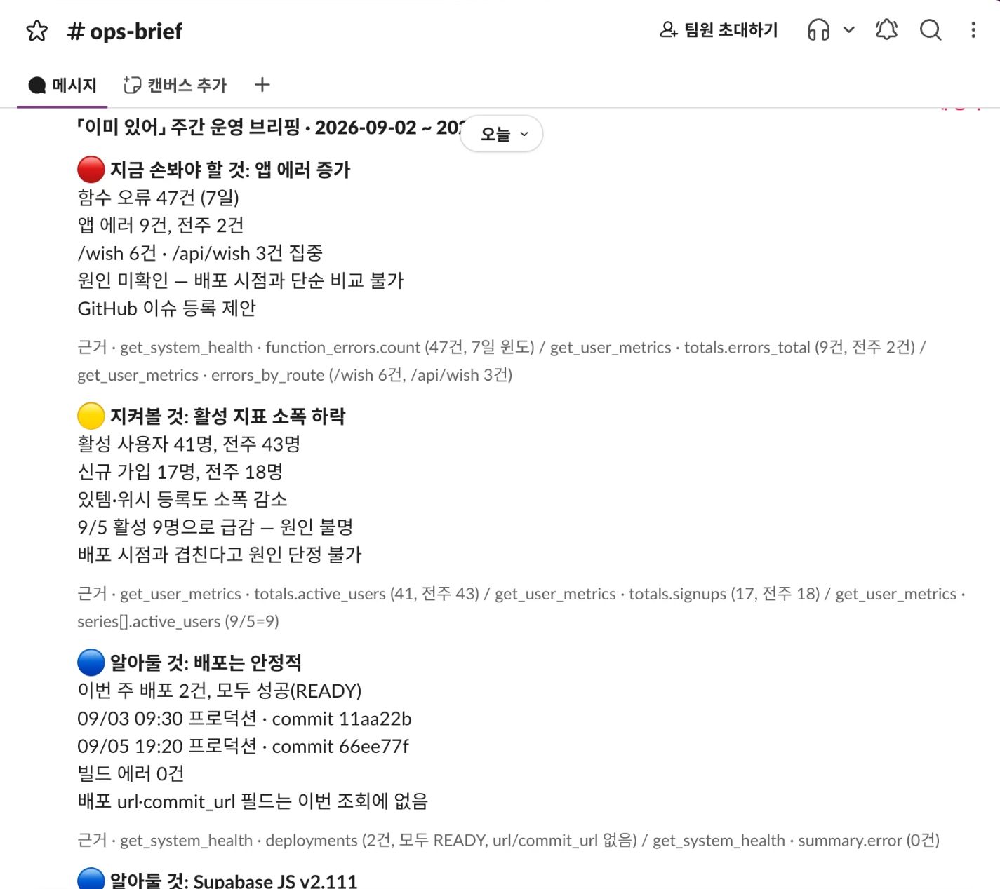

### 4-3. 기준은 사람의 판단과 얼마나 맞았나

세 묶음으로 나눠 쟀다. **기준을 만드는 데 쓴 데이터로 잰 숫자는 증거가 아니다** — 그래서 어느 숫자가 정직한지 함께 적는다.

| 묶음 | 데이터 | 정답을 정한 방법 | 이 묶음의 역할 |
|---|---|---|---|
| dev | 원본 저장소의 실행 9편 (합성 3 · 실제 6) | 사용자가 카드 요약을 보고 (게이트 판정은 가림) | 기준을 **만든** 데이터 |
| holdout | 새 픽스처 실행 4편 (f1~f4) | **실행 전에** 픽스처 사실만 보고 | D41 을 검증 → 놓친 f4 로 `tool_failed` 를 만듦 |
| validation | 새 픽스처 2편 (f5·f6) + 실제 2주 | 픽스처는 실행 전, 실제는 실행 뒤 카드만 보고 (게이트 결과 가림) | D43 을 검증 — **기준을 고치는 데 쓰지 않음** |

| 기준 | dev 9편 | holdout 4편 | validation 4편 |
|---|---|---|---|
| 기준 없음 (전부 자동) | 0/9 · 놓침 5 | 0/4 · 놓침 4 | 0/4 · 놓침 3 |
| (버림) D38 카드 문장 | 4/9 · 놓침 3 · 헛멈춤 2 | 2/4 · 놓침 2 | 2/4 · 놓침 1 |
| D41 = 배포 실패 ∪ 에러 증가 ∪ 방치 이슈 | 5/9 · 0 · 0 *(만든 데이터)* | **3/4 · 놓침 1** · 0 | 1/4 · 놓침 2 · 0 |
| **채택 D43 = D41 ∪ 도구 실패** | 6/9 · 0 · 헛멈춤 1 | 4/4 · 0 · 0 *(만든 데이터)* | **4/4 · 놓침 0 · 헛멈춤 1** |
| 전부 멈춤 | 9/9 · 헛멈춤 4 | 4/4 · 0 | 4/4 · 헛멈춤 1 |

(칸은 개입률 · 놓침 · 헛멈춤.)

- **놓침이 헛멈춤보다 비싸다** (사용자 판단, 3강). 그래서 dev 의 헛멈춤 1(`live-t1`, 사용자 지표 RPC 가 아직 없던 주)을 받아들이고 `tool_failed` 를 넣었다.
  validation 에서 D41 만이었다면 f5 와 실제 09-21 주를 **놓쳤다**.
- **기준 하나씩으로는 모두 놓친다** — 네 기준이 서로 다른 브리핑을 잡는다 (dev: 배포 실패만 놓침 2, 에러 증가만 3, 방치 이슈만 4).
- **정직한 숫자는 validation 의 4/4 · 놓침 0 · 헛멈춤 1 뿐이고, 그것도 약하다.** 네 편 중 두 편(f5·f6)은 기준을 아는 Claude 가 만든 경계 사례라
  맞는 것이 당연하다. 편향 없는 증거는 실제 데이터 두 주다.
- 실제 데이터 8편(dev 6 · validation 2)은 원자료를 공개 저장소에서 뺐다. 저장소의 `gate-compare` 는 합성 9편으로만 돈다 —
  채택 기준 D43 은 dev 3/3 · holdout 4/4 · validation 2/2, 놓침 0 · 헛멈춤 0 (합성 9편은 모두 「봐야 함」이라 헛멈춤을 잴 수 없다).

---

## 5. 데모 화면 설계

목표는 담당자가 **승인 구역 하나만 보고** 판단하는 것이다 (D42). 새 페이지를 만들지 않고 원래 실행 화면(`/runs/{id}`) 안에
`[ PUBLISH GATE ]` 구역을 두었다 — 카드·로그가 같은 페이지 아래에 있어 더 보고 싶으면 스크롤만 하면 된다.

### 5-1. 보여 준 것 — 읽는 순서대로

| 구역 | 4강 요소 | 내용 |
|---|---|---|
| **WHY STOPPED** | ④ 멈춘 이유 | 걸린 기준의 이름 · 값 · **막으려는 위험** 문장. 사람이 먼저 알아야 하는 것은 「왜 내 차례인가」라 맨 앞에 둔다 |
| **SIGNALS · EVIDENCE** | ③ 근거 | 판정에 쓴 네 값과 각각의 도구·필드 출처. 모르는 값은 `0` 이 아니라 「모름」 |
| **SUMMARY · IF APPROVED** | ② 핵심 · ⑤ 결과 | 기간 · 카드 수 · 손봐야 할 것 수 · 고친/지운 카드 수 / 「슬랙에 N장이 메시지 하나로 나가고 **지울 수 없다**」 또는 DRY_RUN 안내 |
| **[ CARDS ]** | ① 보낼 원문 | 슬랙에 나갈 카드 그대로. 걸린 기준과 **관련된 카드**를 노란 테두리와 `GATE · <기준>` 딱지로 짚는다. 수정 모드에서는 카드 자리에서 고치고 지운다 |
| **버튼 네 개** | 응답 | `approve - send as is` · `edit & approve` · `reject`(사유 없으면 안 눌림) · `retry (n/2)`(지시 필수, **비용이 든다**고 옆에 적음) |
| **[ DECIDED BY HUMAN ]** | 기록 | 질문에 한 답 · 승인/거절한 이슈의 제목 · 발행 결정(고친 카드 제목 · 반려 사유 · 다시 판정 지시) · 발송 |

채점하는 쪽이 모델 비용 없이 이 화면을 열 수 있도록 데모 심기(`npm run demo:gate`)를 두었다 — 합성 픽스처로 돌린 실제 실행 세 편과 데모용으로 만든 조용한 주 하나로
멈춘 건 셋과 자동 발행 하나를 만든다 ([README](./README.md) 「모델 없이 승인 화면만 보기」).

그 밖에 대기 목록 `/publish` (NEEDS ANSWER / HANDLED, 걸린 기준, 현지 시각)와 홈 머리의 `[ PUBLISH ] waiting N` 링크.
이름표는 영어, 읽을 글은 한국어로 나눴다 — 버튼과 딱지는 짧게, 판단에 필요한 문장은 모국어로.

### 5-2. 뺀 것과 이유

| 뺀 것 | 이유 |
|---|---|
| 도구 출력 원문 · 실행 로그 · 비용 | 판단에 쓰는 값만 출처와 함께 추렸다. 나머지는 같은 페이지 아래에 있다. 승인 구역이 길어지면 읽지 않고 누르게 된다 |
| 멈춘 이유 안의 출처 코드(`get_user_metrics · totals.errors_total`) | 바로 옆 SIGNALS 에 이미 있다. 두 번 쓰면 어디를 봐야 할지 흐려진다 (D42 개정) |
| 「보낼 원문」 별도 구역 | 처음엔 카드와 같은 내용을 한 번 더 그렸다. 어느 쪽이 보낼 것인지 헷갈려 [ CARDS ] 하나로 합쳤다 |
| 게이트 규칙의 코드 | 규칙 이름 대신 사람이 읽는 label · risk 문장을 쓴다 |

카드 색은 남겨 두되 「게이트는 문장이 아니라 위 값으로 판정한다」고 밝혔다 — 색을 보고 게이트를 오해하지 않게.

### 5-3. 캡처

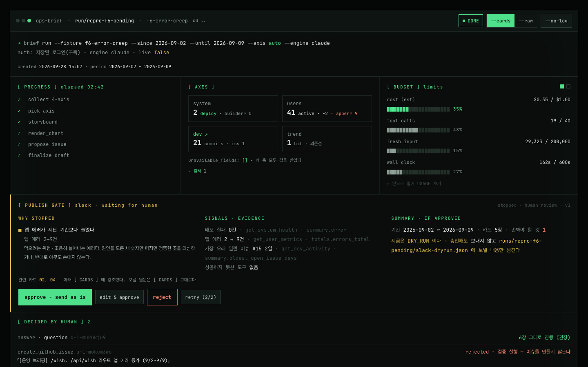

**실행 화면 안의 한 구역** — 새 페이지를 만들지 않고 실행 화면(`/runs/{id}`)에 `[ PUBLISH GATE ]` 를 두었다. 카드 · 로그는 같은 페이지 아래에 있다.

| | |
|---|---|
| 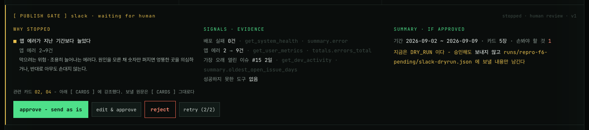 **승인 구역** — f6, `errors_up` 로 멈춤 | 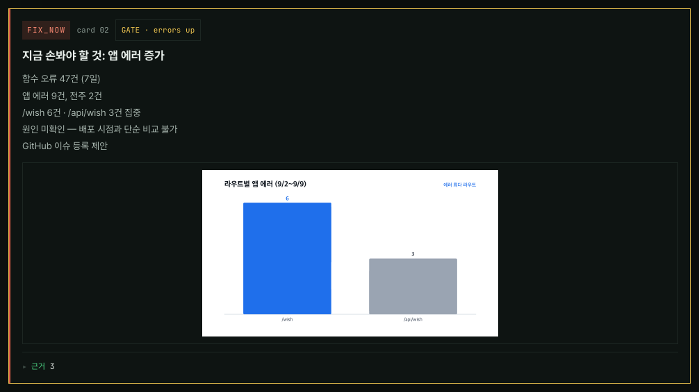 **관련 카드 강조** |
| 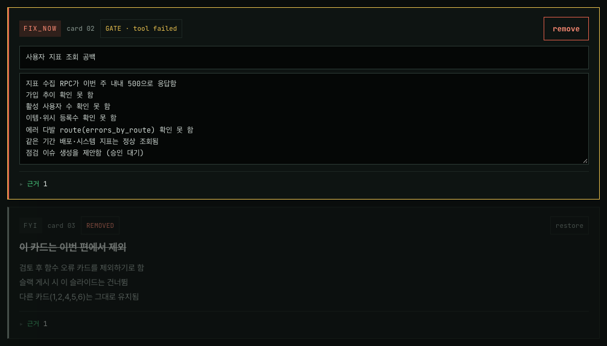 **edit & approve** — 카드 자리에서 고치고 지우기 | 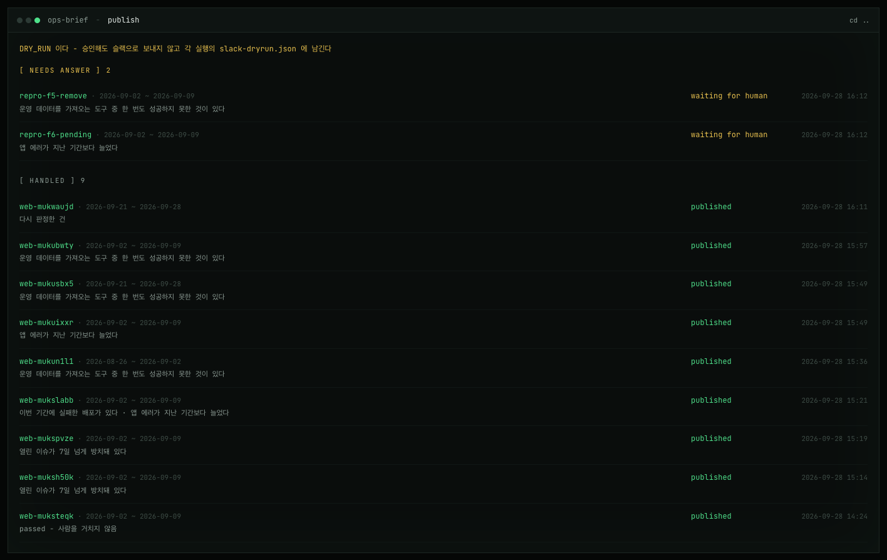 **대기 목록** `/publish` |
| 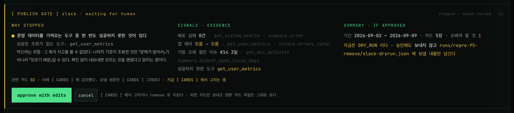 **수정 중** — 고친 카드만 보내는 `approve with edits` · 되돌리는 `cancel` |  **홈 머리의 대기 건수** — 답할 건이 있으면 호박색으로 먼저 보인다 |
| 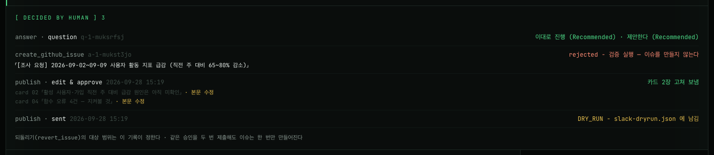 **DECIDED BY HUMAN** — 수정 후 승인 | 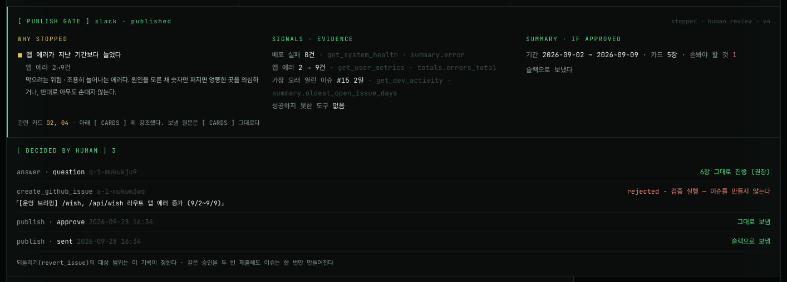 **실제 발송** — 사람 승인 경로 |

전체 13장과 각 캡처의 실행 출처는 [`evidence/hitl/README.md`](./evidence/hitl/README.md).
「대기 중」·「수정 중」 화면은 실제 실행 폴더를 복사해 발행 기록만 지운 **재현본**으로 찍었다 — 캡처할 때는 모든 실제 실행이 이미 답을 받은 뒤였다.

---

## 6. 회고

### 가장 공들인 부분

- **정답을 먼저 붙이고 기준을 쟀다.** 그럴듯해 보이던 카드 문장 기준(D38)이 놓침 3 · 헛멈춤 2 라는 것을 라벨 없이는 몰랐을 것이다.
  「어떻게 썼나」가 아니라 「무슨 일이 있었나」를 재야 한다는 것이 이번의 가장 큰 배움이다.
- **검증 데이터를 나눠 썼다.** dev → holdout → validation 으로 나누고, 정답은 실행 전에 정하거나 게이트 결과를 가린 채 정했다.
  holdout 에서 D41 의 놓침(f4)이 실제로 나왔고, 그 덕에 `tool_failed` 를 찾았다.
- **게이트를 루프 밖, 파일 위에 두었다.** 재시작·중복 클릭·슬랙 오류를 따로 처리하지 않아도 상태 기계 하나가 막았다.
  실제 슬랙 첫 발송이 실패했을 때도 설계대로 `send_failed` 로 남고 resend 로 이어졌다.
- **사람이 쓰다가 부족한 것을 바로 채웠다.** 사용자가 「3번 카드는 제거해」로 다시 판정을 시키자 에이전트가 「도구로 지울 수 없다」며 되물었다.
  지우는 것은 에이전트의 일이 아니라 발행 직전 사람의 일이라 보고 edit & approve 에 카드 삭제를 넣었다.

### 앞으로 보완하고 싶은 점

먼저 지금의 한계다 — 숨기지 않는다.

| 한계 | 내용 |
|---|---|
| **표본이 작고 과적합됐다** | 17편 중 기준을 고치는 데 쓰지 않은 것은 validation 4편뿐이고, 그중 2편은 기준을 아는 Claude 가 만들었다 |
| **사람의 라벨이 한결같지 않다** | 신호가 똑같은 실제 두 주(08-26 · 09-21, 둘 다 GitHub 403)가 「안 봐도 됨」 / 「봐야 함」으로 갈렸다. 어떤 기준도 둘 다 맞출 수 없다. 「설정 문제면 괜찮고 장애면 봐야 한다」로 가르는 안은 검증 세트를 보고 떠올린 것이라 넣지 않았다 |
| **개입률이 높다** | 새 실행 9편 중 8편이 멈췄다. 놓침을 더 비싸게 본 결과지만, 매주 멈추면 4강의 「버튼만 누르는」 상태로 갈 수 있다. 몇 주 더 쌓아 헛멈춤을 봐야 한다 |
| **결측이면 판단하지 못한다** | 에러 비교값이 없으면(`null`) `errors_up` 은 걸리지 않는다. dev 9편 중 6편이 그랬다 |
| **지표 급감은 기준에 없다** | f3 은 사람이 「가입 19→4 급감」 때문에 봐야 한다고 했는데, 게이트는 방치 이슈로 멈췄다. 이슈가 없었다면 놓쳤다. 문턱을 정할 데이터가 없어 이번엔 넣지 않았다 |
| **다시 판정은 판정의 근거를 바꾼다** | 09-21 주는 #16(19일)로 멈췄는데, 다시 판정 중 에이전트가 GitHub 을 다시 조회했고 그사이 #16 이 닫혔다. 그래서 다시 돈 뒤에는 기준에 안 걸려도 **무조건 다시 사람에게** 보이게 했다 |
| **관련 카드 강조는 추정이다** | 데이터 기준은 브리핑 전체에서 걸리므로, 어느 카드가 관련 있는지는 근거 도구·단어로 짚은 표시일 뿐 판정이 아니다 |
| **다시 판정의 비용이 덮어써진다** | 세션을 이어 돌리면 실행 비용이 마지막 세션 값으로 바뀐다 (f2 가 $0.05 로 보이는 이유). 합산해 보여 주지 못했다 |
| **승인해도 틀린 카드가 나갈 수 있다** | f5 에서 사용자가 지우려던 3번 카드는, 삭제 기능이 생기기 전이라 그대로 승인돼 DRY_RUN 으로 기록됐다. 게이트는 사람에게 세울 뿐, 사람이 무엇을 보고 눌렀는지는 보장하지 못한다 |
| **토큰 권한이 게이트를 무력화할 수 있다** | GitHub 토큰에 커밋·PR 읽기가 없던 동안 실제 데이터는 매주 `tool_failed` 로 멈췄다 — 사실상 「전부 멈춤」. 권한을 준 뒤에야 실제 신호(방치 이슈)로 판정했다 |
| **10초 안에 판단한다는 목표는 재지 않았다** | 화면 설계의 목표일 뿐 측정값이 아니다 |

그래서 다음에 할 일:

1. **몇 주를 더 쌓아 헛멈춤을 본다.** 매주 실제 데이터로 돌리고, 사람의 답(그대로 승인이 몇 번인지)을 헛멈춤의 신호로 쓴다.
2. **도구 실패를 종류로 나눈다** — 설정(`scope_denied` · `rpc_not_created`)과 장애(`rate_limited` · 500). 새 데이터로 검증한 뒤에만 넣는다.
3. **지표 급감 기준** — 몇 주치 분포가 생기면 문턱을 정한다.
4. **다시 판정 비용을 누적해 보인다.** 사람이 retry 를 누를 때 지금까지 든 비용을 함께 보여 준다.
5. **구글챗 어댑터** — Workspace 계정이 생기면 `sendSlack` 옆에 붙인다.

### 코드 리뷰로 고친 것

제출 전 코드 리뷰에서 지적된 것을 코드에서 확인해 여섯 가지를 고쳤다 (D44) — 사용자 지표 SQL 의 기간 오집계,
승인 토큰 난수, SDK 상한 종료의 상태 보고, 승인 버튼이 네트워크 실패에 잠기던 것, 끝없는 폴링, 깨진 lint 스크립트.
고치지 않은 지적은 이유와 함께 D44 에 적었다.
